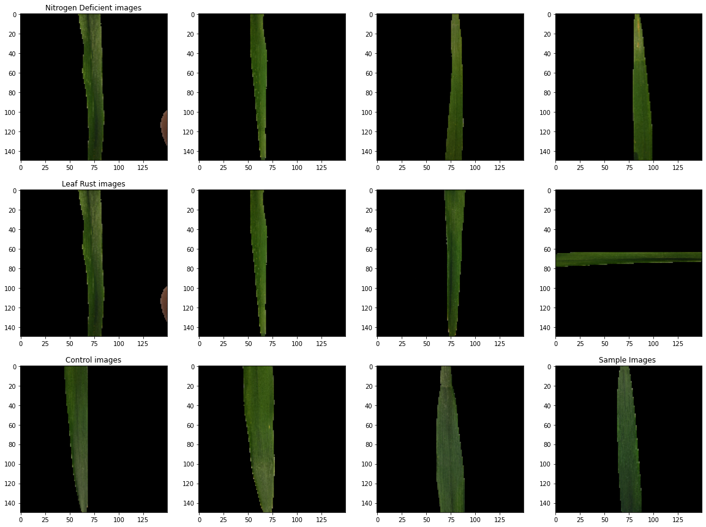

# Classifying wheat leaf disease using convolutional neural networks

### Table of Contents

1.   Background
2.   Methods
3.   Results
4.   Discussion
5.   Literature

### 1. Background
Wheat is a staple food of mankind with 765 million tonnes produced in 2019 (FAOSTAT). Accounting for a fifth of humanity’s food, wheat is second only to rice which provides 21% of the food calories and 20% of the protein for more than 4.5 billion people in 94 developing countries (Braun et al., 2010). 
<i>Puccina triticina</i> is a fungal disease of affecting a range of crops but most notably wheat crops worldwide. Also known as brown leaf rust it is widely recognised a one of the most important diseases, causing around 4% in yield reduction worldwide (Dulleiller et al., 2007) but reductions in up to 50% have been recorded (Draz et al, 2015). While leaf rusts have a complex lifecycle with both sexual and asexual reproduction as well as multiple hosts it is beyong the scope of this analysis. Importantly it occurs on the leaf blade with infections appearing as small round pustules with an orange, brown colour surrounded by a yellow ring of chlorotic leaf tissue, these very identifiable pustules contain the spores.
There are 2 main methods of controlling brown rust in fields, resistant varieties, and chemical sprays. The use of resistant varieties is much more in line with the rational of modern farming techniques. The main issue with resistant varieties is the appearance of new strains that can infect previously resist varieties. To combat this there are fungicides on the market that do offer control, but it is important to ensure that their effectiveness is not impacted.

To try and protect both cultural and chemicals controls effectiveness, it is key to utilise the pillars of Integrated Pest Management (IPM). This can be better achieved with the use of modern technologies such as precision agriculture. The rise of precision agriculture has allowed farming to gather more detailed data on smaller and smaller areas as well as machines more capable take full advantage of such systems.

Accurate automated high-throughput phenotyping of plant diseases has the potential to aid crop management, speed up breeding, and contribute to fundamental and applied research efforts (Pauli et al, 2016). With companies like the small robot company (link can be found [here](https://www.smallrobotcompany.com/)) being developed one could envision small mapping robots being used to travel the fields, identify high disease areas, and highlight these regions for chemical control. A system like this would allow for improved diagnosis and better use of chemical fungicides as well as removing the subjective nature from resistance scoring in crop trials (Bock et al. 2009).

While a system such as this may be seen in the future, there are several challenges for both the hardware and software to overcome. One such challenge is reliably distinguishing between a diseased plant and other forms of damage (DeChant et al. 2017). Image based identification is the best way to approach such a problem, by using Convolutional Neural Networks (CNN) to extract useful features from images without needing manual feature engineering. Using a CNN to correctly identify the presence of a leaf rust infection on the surface of a leaf when only comparing it to perfectly healthy leaves would be very simple, but not very practical as any discolouring of the leaf could lead to an incorrect identification.

To add a layer of practicality a third class is included in the data, leaves that are nitrogen deficient. Nitrogen deficiency is the most common nutrient deficiency and results in paler green leaves with yellowing at the leaf tip reducing grain yield. On a model such as this with such a small dataset overfitting will be the biggest problem to overcome.

The objectives of this analysis were to create a convoltional neural network capable of identifying disease, tune the model for highest levels of accuracy and examine what the deep learning model is using for classifaction i.e., the leaf rust pustules or something less expected. With the overarching aim of this analysis is to correctly identify images of wheat leaves infected with leaf rust, leaves suffering with a nitrogen deficiency and leaves that are perfectly healthy.

### Data 

The data for this analysis consists of 1459 images of wheat leaves, split into 2 subsets Nitrogen Deficient (abiotic stress) and Rust (biotic stress) and further split outlined in Fig. 1. below (the number of images in each subset). 
The data was collected with an RGB camera from a wheat crop sown in the winter 2019 and harvested in 2020, the fields were a part of the Indian Agriculture Research Institute. The leaf images were acquired at the booting stage of a wheat crop. After the pictures were taken, the images were segmented from the background using Otsu-based masking (Arya et al. 2020).

The files for this analysis can be found at this [link.](https://data.mendeley.com/datasets/th422bg4yd/1). 

Fig. 2.

| Nitrogen Deficient | Rust         |
|--------------------|--------------|
| **Train:**         |              |
| N deficient (209)  | Rust (258)   |
| Control (209)      | Control(258) |
| **Test:**          |              |
| N deficient (44)   | Rust (54)    |
| Control (44)       | Control (73) |
| **Validation:**    |              |
| N deficient (44)   | Rust (54)    |
| Control (44)       | Control(73)  |

